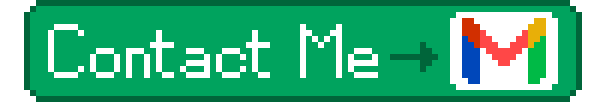

<!-- Full-width profile banner -->

<!-- Centered contact buttons -->

  <!-- Opens LinkedIn profile and email -->
  
  

<!-- Decorative animated divider -->

## 💫 About Me

<!--Hi! I'm **José Pablo**, an Artificial Intelligence Engineering student from Mexico with a strong interest in **machine learning, computer vision, and computer graphics**.

My goal is to become a **Machine Learning Engineer** with real-world experience developing reliable software and intelligent systems. I am especially interested in projects where artificial intelligence can be used to solve practical problems and create tools that are genuinely useful.

I'm currently at the beginning of my professional journey, so there is still a lot I want to learn and improve. However, I am committed to practicing consistently and becoming a better developer with every project I build.

🌱 Always learning 
🚀 Always building 
🎯 Always improving -->

<!-- Pixel art "about me" info -->

## 💻 My Skills

<!-- Skill icons -->

  
  
  

<!-- Decorative animated divider -->

